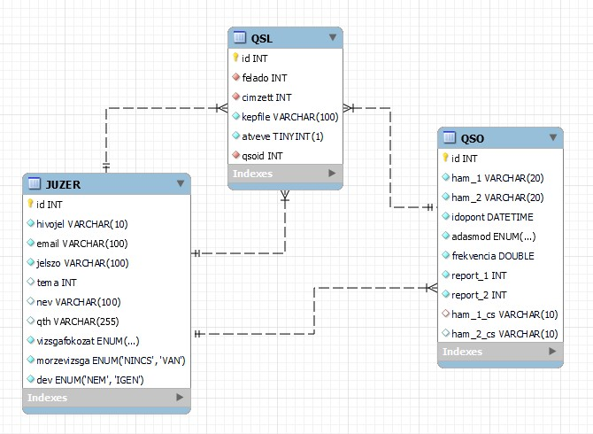

# A webalkalmazás célja

A rádióamatőrök kedvtelésből és egyéni érdeklődésből, anyagi hasznon nélkül foglalkoznak a rádiózással, és a számukra kijelölt hullámhosszokon lépnek kapcsolatba egymással. A rádióamatőrködéshez külön vizsga és engedély kell, és az összeköttetéseket mindkét oldalnak naplóznia kell. Az összeköttetések során egy (világszinten) egyedi *hívójellel* azonosítják magukat az amatőrök. Hagyomány, hogy néhány összeköttetést követően az amatőrök egymásnak egyfajta képeslapot, úgynevezett QSL-lapot küldenek egymásnak, amelyet újabban különböző honlapokon elektronikus formában is meg lehet tenni.
Az engedélyesek listáját és néhány adatát a hatóság nyilvánosan közzéteszi, de a naplókra nincs kötelező hivatalos felület.

A webalkalmazás egy rádióamatőr naplózó alkalmazást valósít meg. Az amatőrök regisztrálhatnak a weboldalra, feljegyezhetik az összeköttetéseiket, és küldhetnek (fogadhatnak) QSL-lapot az összeköttetéseik alapján. Az összeköttetések feljegyzésének **nem** feltétele, hogy a másik amatőr is regisztrált felhasználó legyen, de QSL-lapot csak regisztrált felhasználónak lehet küldeni.

## Adatbázis

### Amatőrök

A rádióamatőr engedély többek között a következő adatokat tartalmazza (25/2013 IX. 25. NMHH rendelet 10. § alapján):
- az engedélyes nevét
- lakcímét
- kijelölt hívójelét
- az engedély fokozatát (kezdő, CEPT Novice, CEPT)
- kézi távíró (morze) használatának lehetőségét (tett-e morze vizsgát az amatőr)

Amennyiben az amatőr ehhez hozzájárul, ezen adatokat (de nem minden adatot az engedélyből) a hatóság nyilvánsan közzétesz. Ellenkező esetben az adatoknak csak egy részét (keresztnév, város, stb.) teszi közzé. Ezen okból a webalkalmazásban a nevet és lakcímet célszerű opcionálisan tárolni, de minden további adatra szükség van, így azoknál indokolt a `not null` feltétel.

A webalkalmazásban célszerű még tárolni a következő adatokat:
- numerikus ID
- e-mail cím
- jelszó (hash)
- kiválasztott téma
- jogosultság (adminisztrátor vagy sem)

A kiválasztott téma kivételével szintén minden adat kötelező, de természetesen egyik sem nyilvános. 
Egy már regisztrált felhasználó módosíthatja bármely adatát, ez alól célszerű hogy kivételt képezzenek a következők:
- numerikus ID
- jogosultság
- hívójel

### Összeköttetések (QSO)

Az amatőrök közötti összeköttetések (továbbiakban: QSO-k) után a következő adatokat kell naplóznia az amatőröknek a 25/2013 IX.25. NMHH rendelet 17. § alapján:
- a forgalmazás dátuma
- a forgalmazás megkezdésének ideje UTC szerint
- az ellenállomás hívójele
- frekvencia és adásmód
- az összeköttetés minőségét (jelerősség, érthetőség) jellemző számpár/számhármas ("riport")

Természetesen mivel egy táblában nem csak egyetlen amatőr naplóbejegyzései szerepelnek, így tárolni kell a naplóbejegyzést létrehozó amatőr hívójelét is. Érdemes továbbá feljegyezni nem csak a vett riportot, hanem azt is, amit a másik állomás jelzett vissza hogy vett. A tároláshoz ajánlott még ID oszlopot hozzáadni a táblához. Mivel a korábban felsorolt részek feljegyzése kötelező, így az egész tábla minden oszlopára indokolt a `not null`.

Mivel naplóról van szó, így egy már elmentett bejegyzést nem célszerű módosítani. Különleges esetben erre mégis szükség lehet, így érdemes egy adminisztrátori felületen ezt mégis lehetővé tenni.

#### A hívójelképzésről

A hívójelekről a rendelet 12. § rendelkezik. A hívójelek 4-10 karakteresek lehetnek. Speciális esetektől eltekintve a magyar hívójelek `HA` vagy `HG` betűkkel kezdődnek, amelyet egy szám követ, majd minimum 2 és maximum 4 karakter. Külföldi hívójelek esetében a `HA` vagy `HG` prefix helyett 1-3 karakteres, számokat is tartalmazó prefix állhat [ezek listája](https://en.wikipedia.org/wiki/ITU_prefix), de ezt is mindig követi egy szám és egy suffix (amely betűket és számokat tartalmazhat).

Amennyiben egy rádióamatőr a szokásos telepítési helyétől távol rádiózik, akkor a használt hívójelét egy postfixel kell kiegészítenie (`/P`, `/M`, `/MM`, `/AM` a magyar szabályozás szerint), amely minimum 1, maximum 3 alfanumerikus karakterből áll.

Amennyiben egy rádióamatőr nemzetközileg elismert vizsgát tett, és ennek megfelelő engedélye van (`CEPT` szintű engedély), akkor a CEPT ajánlásokat elfogadó országokban minden további nélkül rádiózhat, csak a hívójelét kell kiegészítenie az adott ország prefixével.

Példa: ha a `HA7ABCD` hívójelű amatőr németországból rádiózik, akkor a `DL/HA7ABCD/P` (`/M`, `/MM`, `/AM`, helyzettől függően) hívójelet kell használnia.

Természetesen a naplóba a használt hívójelet kell beírni, de attól még az összetett hívójel logikailag meg kell egyezzen az eredetivel. Ennek érdekében az adatbázisban a `QSO` tábla két extra oszlopot is kell hogy tartalmazzon, amelyek a pre/postfixek nélküli hívójelet tartalmazzák. Ezek az oszlop lehet a naplóban szereplő hívójelekből az adatbázis motor által automatikusan generáltak.

Mivel nem feltétele a naplóbejegyzéseknek, hogy az összeköttetés másik oldala is regisztrált felhasználó legyen, így csak az egyik oszlopra lehet külső kulcs feltételt rakni. Ettől eltekintve viszont minden szempontból szimmetrikusan kell kezelni a két hívójel-oszlopot. Célszerű, hogy a műveleteket (join, keresés, indexelés) ne a naplóbejegyzésben szereplő, hanem a lecsupaszított hívójelen végezzük.

### QSL-lapok

QSL-lapot már naplózott összeköttetés alapján lehet küldeni. Célszerű tárolni (külső kulcsként) a QSO-t, illetve a címzettet és a feladót (külső kulcsként). Tárolni kell továbbá egy képfile-t (név alapján), és egy jelzést hogy a címzett átvette-e a lapot. A QSL csak akkor érvényes, ha ez mind ki van töltve, így itt is minden `not null` feltétellel van.

### Séma

Egy, a korábbiaknak megfelelő adatbázis-modell:


És az ehhez tartozó SQL file:

```sql
-- @@@@@@@@@@@@@@@@@@@@@@@@@
-- @ ADATBÁZIS LÉTREHOZÁSA @
-- @@@@@@@@@@@@@@@@@@@@@@@@@

-- takarítás
drop database if exists HAM;

create database HAM
	DEFAULT CHARACTER SET utf8mb3
	DEFAULT COLLATE utf8_general_ci; -- case-insensitive collation    
use HAM;

-- DB user setup hogy ne roottal kelljen belépni PHPből
GRANT ALL PRIVILEGES ON HAM. * TO 'access_denied';
FLUSH PRIVILEGES;

-- juzer = felhasználó
create table JUZER (
	id int primary key auto_increment,
	hivojel nvarchar(10) not null unique,
    email nvarchar(100) not null,
    jelszo nvarchar(100) not null, -- egyértelműek, kötelező megadni őket
    tema int default 0, -- frontend téma, nem kötelező
    nev nvarchar(100),
    qth nvarchar(255), -- ezt a kettőt nem kötelező megadni, de ha megadják akkor publikus
    vizsgafokozat enum ('NINCS', 'KEZDŐ', 'CEPT NOVICE', 'HAREC') not null, -- a 'nincs' logikailag kevésbé értelmes, mivel engedély nélkül nincs hívójel sem
    morzevizsga enum ('NINCS', 'VAN') not null,
    dev enum ('NEM', 'IGEN') not null
);

create table QSO (
	id int primary key auto_increment,
    -- érvényes QSOhoz mindent ki kell tölteni szóval minden not null
	ham_1 nvarchar(20) not null,
    ham_2 nvarchar(20) not null,
    idopont datetime not null,
    adasmod enum ('CW', 'DSB', 'USB', 'LSB', 'NFM', 'RTTY') not null,
    frekvencia double not null,
    report_1 int not null,
    report_2 int not null,
    -- lehet pre/postfixekkel ellátott hívójelet is haszználni, so szépen extractoljuk belőle a lényeget
    -- regex követelmény volt, so raktam bele...
	ham_1_cs nvarchar(10) generated always as (REGEXP_REPLACE(ham_1, '([A-Za-z0-9]{1,3}/)?([A-Za-z0-9]{1,3}[0-9][A-Za-z]{1,5})(/[A-Za-z0-9]{1,3})?', '$2')) stored,
    ham_2_cs nvarchar(10) generated always as (REGEXP_REPLACE(ham_2, '([A-Za-z0-9]{1,3}/)?([A-Za-z0-9]{1,3}[0-9][A-Za-z]{1,5})(/[A-Za-z0-9]{1,3})?', '$2')) stored,
	foreign key (ham_1_cs) references JUZER(hivojel) -- csak az egyikre lehet, mivel nem biztos hogy a másik oldal regisztrált
);

-- akarunk majd kereseni erre is
create index hcs1 on QSO(ham_1_cs);
create index hcs2 on QSO(ham_2_cs);
-- hívójelre nyilvánvaló, szépen join lesz

create index dt on QSO(idopont);
-- időpont: pl. "utolsó X QSO", illetve rendezés dátum szerint
create index f on QSO(frekvencia);
-- frekvencia: "QSO-k ezen a sávon"


create table QSL (
	-- ez is csak akkor értelmes ha minden not null
	id int primary key auto_increment,
    felado int not null,
    cimzett int not null,
	kepfile nvarchar(100) not null,
    atveve bool not null,
	qsoid int not null,
    -- ha user törölheti magát akkor ezt át kell gondolni, mivel a QSL-eket sem szabad törölni
    foreign key (felado) references JUZER(id),
    foreign key (cimzett) references JUZER(id),
    foreign key (qsoid) references QSO(id)
);

create index felado on QSL(felado);
create index cimzett on QSL(cimzett);
```

Természetesen ez a fejlesztés során megváltozhat, mely esetben mellékelni kell egy listát a változásokról.

## Funkciók

### User regisztráció
Paraméterként:
- hívójel
- email
- jelszó (2x megadni a felületen, de ez csak kliensoldali)
- név (opcionális)
- QTH (opcionális)
- vizsgafokozat (ENUM)
- morzevizsga (ENUM)

Beszúr egy új usert.

Lehetséges hibák
- létező hívójel az adatbázisban
- formátumhiba (kliensoldalon és PHP-ban is ellenőrizni kell)

### User belépés
Paraméterek:
- hívójel
- jelszó

Belépteti a felhasználót, azaz ha a hívójel/jelszó stimmel, akkor a sessionben beállítja hogy ezen hívójellel beléptünk. Feljegyzi a belépés dátumát, hogy ne legyen korlátlan ideig érvényes.

Lehetséges hibák:
- hibás hívójel / jelszó
- már be vagyunk lépve valakivel

### User kilépés
Nincs paraméter

Kilépteti a felhasználót

Lehetséges hibák:
- nem vagyunk belépve

### Amatőrök listázása
Paraméterek:
- listázandó oldal száma

Oldalanként fix számú rekordot jelenít meg a táblából, hívójel szerint betűrendben.
Valamely amatőrre való kattintás átirányít az Ő QSO-inak lisájára.

Nem kell külön oldal, lehet a kereséssel összevonni

### Keresés amatőrök között
Paraméterek:
- keresett kifejezés
- keresés helye (valid: hívójel, név, QTH)
- listázandó oldal

Egyszerű LIKE %..% természerű keresés az amatőrök között. Az eredmény hívójel szerint van rendezve.

Lehetésges hibák:
- ha a keresés helye nem valid, akkor nem adunk vissza adatot

### QSO-k listázása dátum szerint csökkenő sorrendben
Paraméterek:
- oldal száma

Minden QSO-t listáz, dátum szerint csökkenő sorrendben

Nem kell külön oldal, lehet a kereséssel összevonni

### QSO-k egyszerű keresése
Paraméterek
- oldal száma
- keresett kifejezés
- keresés helye (amatőr, adásmód, sáv)

String alapú keresést végez, kivéve SÁV-nál, itt adott határok között keres. Az amatőrre való keresést mindkét naplóoszlopban teszi (nem a lecsupaszítottban).

### Saját QSO-k listázása (bejelentkezés után)
Saját QSO-inkat listázza. Hasonlóan lehet benne keresni mint a közös listában (szintén oldalakra osztva)
Minden QSO mellett megjelenik egy link QSL lap küldésére

Paraméterek
- oldal száma
- keresett kifejezés
- keresés helye

Hibák:
- nem valid keresés
- nem jelentkeztünk be

### QSL lap küldése
Belépés szükséges
- QSO irányít ide
- képet kell feltölteni

Paraméterek
- QSO id
- képfile

Hibalehetőség:
- nem regisztrált felhasználó a másik oldal
- nincs kitöltve minden
- hibás paraméter
- nem jelentkeztünk be

### küldött QSL lapok listázása
Belépés szükséges

Paraméter
- oldal

Saját küldött QSL lapokat listázza, jelölve hogy a másik oldal elfogadta-e

Hiba
- nem jelentkeztünk be

### fogadott QSL lapok listázása (és elfogadása)

Külön mezőben listázza a még nem elfogadottakat.

Paraméterek
- elfogadás: melyiket

Hibák:
- hibásat próbálunk elfogadni
- nem jelentkeztünk be

### Témaváltás

Legördülő menüből kiválasztható másik bootstrap téma (bootswatch-ból)
Elmenti a beállítást sütibe, de ha be vagyunk jelentkezve, akkor adatbázisba is lementi.

A funkció minden oldalról elérhető, háttérben küld kérést ha be vagyunk jelentkezve

Paraméter
- új téma

Hiba:
- nem érvényes téma

### User adat módosítás
Bejelentkezés szükséges

Paraméterek:
- mint a regisztrációnál

Hibák
- hibás paraméter
- nem is vagyunk bejelentkezve

### DEV nézet

DEV nézetben megnézhetjük minden tábla mindent elemét, kereshetünk mindegyikre, és szerkeszthetünk is minden sort.

## Megvalósítás

- docker környezetben
- mysql adatbázis
- php
- nginx